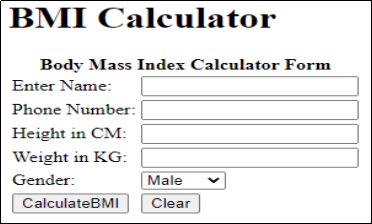
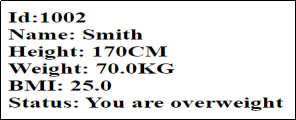

# Body Mass Index

A leading XYZ Finance Company decided to provide service through online for customer. This Portal has to provide various services. BMI stands for Body Mass Index. It is a measure of body mass based on height and weight of an individual. One of the services is BMI Calculator. The customer can use this portal to calculate BMI .Using the range of BMI, individuals are classified as underweight, normal or overweight. Its value is in a specific range for a healthy individual. The following table shows the main BMI categories.

| Category | BMI Range |
| -------- | --------- |
| Underweight | < 18.5 | 
| Normal | 18.5 – 25 | 
| Overweight | 25 – 30 | 
| Obese | > 30 | 

> Formula for Calculating BMI in Metric Units

    BMI = Weight in Kg/(Height in Meters * Height in Meters)
    Example calculation for weight = 90kg, height = 1.5m
    BMI = 90/(1.5*1.5) = 40

Create Web application to calculates BMI value based on inputs in metric units. The BMICalc Service web application aims at the following features 

1.Calculate BMI by providing user details and add the user details to collection.
2.View the BMI status after successful calulation.

## Data Design

This project currently does not connect with the DB server and therefore uses the in-memory storage using java collections (HashMap) to perform read/write operations related to the scope of the application.

### Component Design 

**Component name**:  src/main/webapp/WEB-INF/views/bmiCalculatorForm.jsp

**Description**: This JSP is used by the user to calculate their BMI. The URL for this page is /bmiForm which has to be launched from the browser’s address bar which means that it is a HTTP GET request. The page looks something similar to the image shown below.

All the labels are created as per the above page. The following table provides the more information about the above image.

| Field Name | Field Type | Component ID | Description | 
| ---------- | ---------- | ------------ | ----------- |
|  | `<H1>` | heading | BMI Calculator – text of h1 tag | 
| Form | `<form>` | form(should be name and not id)	|  |
| name | Textbox | name | This field holds the customer name | 
| phoneNumber | Textbox | phoneNumber | This field holds the phone number | 
| height | Textbox | height | This field holds the hight in CM | 
| weight | Textbox | weight | This field holds the weight in KG | 
| genderType | Drop down | genderType | This field lists the gender types . User can select their gender type from the dropdown list. | 
| "calculateBMI" | Submit | "calculateBMI" (should be name and not id) | When this button is clicked, the URL that has to be executed is /getBMI which is the declared in the action attribute of `<form>`  tag. The type of the http method is GET. This URL has to be mapped to getBMIStatus getBMIStatus(@ModelAttribute("user") @Valid User user, BindingResult result, ModelMap map) method of the UserController class | 
| Cancel | reset |  | This button is used to reset the data |

**Note**: The values in the Gender drop-down must be auto populated from the controller with the values as given in the below table. They should not be populated/hardcoded inside the JSP.

| GenderType |
| ---------- | 
| Male | 
| Female |
| Others |

**Component Name**: src/main/webapp/WEB-INF/views/bmiStatus.jsp

**Description**: This page displays user bmi status information, when all the details entered are added to collection successfully; it should print the message in h2 tag. And h2 tag id should be “status”

### Business Validation for Component 

| Rule | Error Message (If validation fails) | 
| ---- | ----------------------------------- |
| Name field is  mandatory | Name is required | 
| phoneNumber field is mandatory | Phone number is required | 
| Height field is mandatory(use NotNull annotation) | Height is required | 
| height with Min value | Height should be > 0 | 
| Weight field is mandatory(use NotNull annotation) | Weight is required | 
| Weight with Min value | Weight should be > 0 |

### Technical Requirements:

**Class name**:  User

**Package**:   com.cognizant.bmi.bean

The User is a model class and is used to contain the details of the User

| Attributes | Method |
| ---------- | ------ |
| userId : int name: String phoneNumber: String height: Integer weight: Double genderType: String | getter/setter |

**Class name**:  BMIService is a service containing following members
**Package**:  com.cognizant.bmi.service

| variable Name | Data type	Responsibilities |
| ------------- | -------------------------- |
| genderType | List<String> | This static attribute initialize with new ArrayList() |
| userList | Map<Integer,User> | This static attribute initialize with new HashMap() |
| userId | int | This is static attribute initialize with 1000 |

In this class constructor adds the data into genderType attribute. The following table gender type information here. 

| GenderType | 
| ---------- |
| Male |
| Female | 
| Others |

This class provides addUserDetails method which is used add the user data into in the collection.

|Method Name | Input Parameters | Output Parameters | Description |
| ---------- | ---------------- | ----------------- | ----------- |
| addUserDetails | user:User | User | This method pre increment userId. Add the user Object into userList and return the user object. | 
| calculateEMI | user:User | double	This method takes a user input as parameter. It should calculate bmi using given formula  `double bmi = (100*100*Weight)/(Height*Height);` Use Math.ceil(bmi) round the bmi value and return it.
| getBMIStatus | double | bmi | String | According given requirement it should check the bmi value and return the String message “You are message” | 

**Class name**:  BMIController is a controller class.

**Package**:   com.cognizant.bmi.controller

This class provides the methods for processing various kinds of HTTP requests such as displaying a bmiForm where user can input the. This class also provides the request processing methods for getEMI and displaying the BMI status.

> UserController

| Attribute Name | Attribute Type | Access Specifier | Constraints |
| -------------- | -------------- | ---------------- | ----------- |
| bmiService | BMIService | Private | Use annotation to autowire | 

| Method Name | Method Argument name: type | Return type | RequestMapping URL & request method | Description | 
| ----------- | -------------------------- | ----------- | ----------------------------------- | ----------- |
| showBMIForm | @ModelAttribute("user") User user | String | /bmiForm & GET | This method shows BMI  Form in the browser. |
| getBMIStatus | @ModelAttribute("user") User user, BindingResultresult , ModelMap map | String | / getBMI & GET | Description added below of the table | 
| genderList |  | List<String> | Should be annotated with | Using BMIService. loanList get gender |
|  |  |  | Should be annotated with ModelAttribute with name “genderList” | Using BMIService. loanList get gender list. |

> Description for getBMIStatus() method:

- This method receives user object as parameter.
- Return page “bmiCalculatorForm” if it has any errors.
- Otherwise it invoke bmiService.addUserDetails(user),  add  the details into the collection and store the return value into local user Object. 
- Then invoke the bmiService.calcuateBMI(user) collect the return value into local variable bmi.
- Then invoke the bmiService. getBMIStatus (bmi) collect the return value into local variable bmistatus.
- Add user object, bmi and bmiStatus into modelmap and return the page name “bmiStatus”.